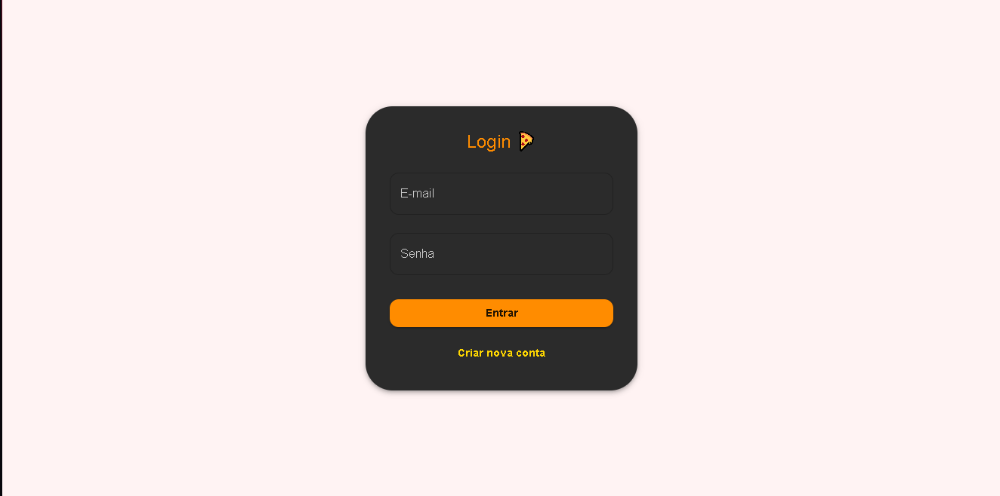
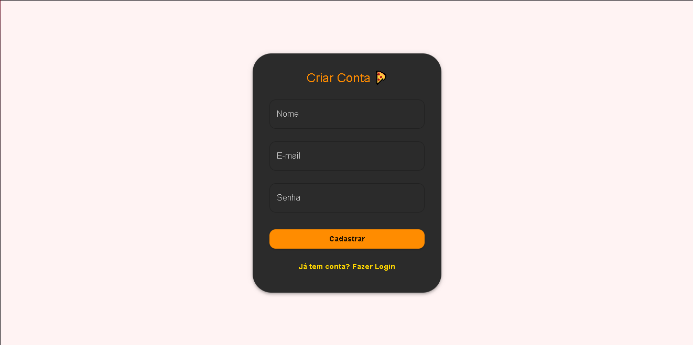
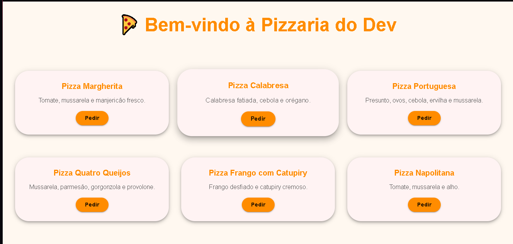
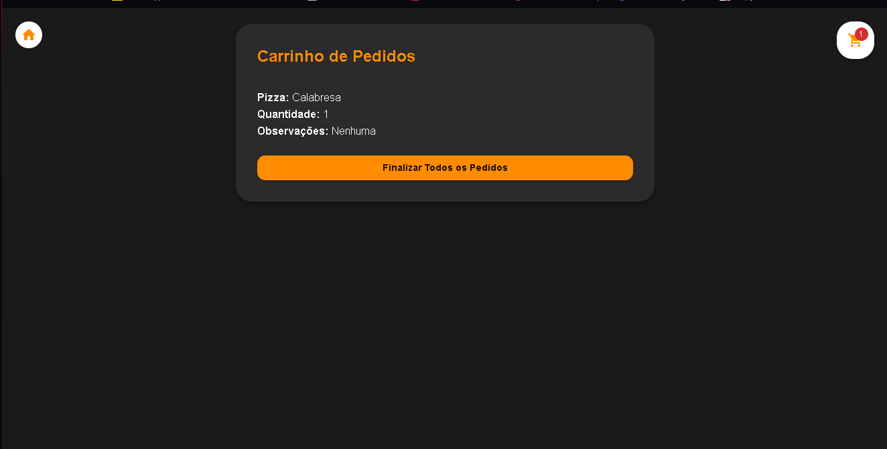

# 🍕 PizzaVerso by bcl19


> Sistema completo de pizzaria com cadastro, login, carrinho e finalização de pedidos.

A **PizzaVerso** é um projeto full-stack feito com **React + TypeScript MaterialUI** no front-end e **Node.js + Express + SQLite** no back-end.
Ideal para aprender conceitos de autenticação, CRUD, gerenciamento de estado e integração front-end/back-end.

---

## 🌐 Demo 
[🌟 Acesse o projeto no navegador](https://pizzaria-bernardo.vercel.app)

---

## 🛠 Tecnologias

**Front-end**

* React + TypeScript
* Material-UI (MUI)
* React Router DOM
* Axios
* Framer-motion

**Back-end**

* Node.js + Express
* SQLite
* bcryptjs para hash de senhas
* jsonwebtoken para autenticação

**Gerenciamento de estado**

* Context API (AuthContext e CartContext)

---

## 📦 Funcionalidades

### Usuário

* Cadastro com email, nome e senha.
* Login com autenticação JWT.
* Proteção de rotas e verificação de token.

### Pedidos

* Visualização de catálogo de pizzas.
* Adição de pizzas ao carrinho.
* Observações em cada pizza.
* Finalização de pedidos e envio ao back-end.

### Interface

* Responsiva e moderna usando **Material-UI**.
* Feedback visual para ações como cadastro, login e finalização.
* Interface animada nos icones com **Framer-Motion**

---

## 🚀 Como rodar o projeto

### Pré-requisitos

* Node.js >= 18
* npm >= 9
* Vite 

### 1️⃣ Clonar o repositório

```bash
git clone https://github.com/bcl19/pizzaria-bernardo
cd pizzaria-bernardo
```

### 2️⃣ Instalar dependências

#### Back-end

```bash
cd pizzaria-backend
npm install
```

#### Front-end

```bash
cd pizzaria-frontend
npm install
```

### 3️⃣ Executar

#### Back-end

```bash
node server.js
```

Servidor rodando em `http://localhost:5000`

#### Front-end

```bash
npm run dev
```

Front-end rodando em `http://localhost:5173`

---

## 📁 Estrutura do projeto

```

pizzaria-backend/
├─ models/
├─ routes/
├─ database.db
├─ package.json
└─ server.js
pizzaria-frontend/
│
├── public/
│   └── favicon.ico
│
├── src/
│   ├── api/
│   │   └── (arquivos de comunicação com o backend)
│   │
│   ├── components/
│   │   ├── CadPage.tsx          # Página de cadastro do pedido (componente)
│   │   ├── CartButton.tsx       # Botão flutuante do carrinho
│   │   ├── FinalPage.tsx        # Tela final do pedido
│   │   ├── HomeButton.tsx       # Botão para retornar à página inicial
│   │   ├── LoginPage.tsx        # Tela de login (com layout e estilo próprio)
│   │   ├── PrincipalPage.tsx    # Tela principal (seleção de pizzas)
│   │   └── SignupPage.tsx       # Tela de cadastro de usuário
│   │
│   ├── context/
│   │   ├── AuthContext.tsx      # Contexto de autenticação
│   │   ├── CartContext.tsx      # Contexto do carrinho de pedidos
│   │   ├── CartProvider.tsx     # Provedor global do carrinho
│   │   └── types.ts             # Tipos e interfaces globais
│   │
│   ├── hooks/
│   │   ├── useAuth.ts           # Hook personalizado de autenticação
│   │   └── useCart.ts           # Hook personalizado do carrinho
│   │
│   ├── img/                     # Imagens utilizadas no projeto
│   │
│   ├── pages/
│   │   ├── Cadastro.tsx         # Página para cadastro de usuário
│   │   ├── CadPedido.tsx        # Página para montar o pedido
│   │   ├── FinalPedido.tsx      # Página de finalização do pedido
│   │   ├── Login.tsx            # Página de login do usuário
│   │   └── Principal.tsx        # Página principal de seleção de pizzas
│   │
│   ├── App.tsx                  # Arquivo principal do aplicativo
│   └── App.css                  # Estilos globais
│
└── index.html

```

---

## 🔗 Endpoints Principais (API)

### Usuários

| Rota               | Método | Body                                   | Retorno     |
| ------------------ | ------ | -------------------------------------- | ----------- |
| `/api/auth/signup` | POST   | `{ nome, email, password }`            | `{ token }` |
| `/api/auth/login`  | POST   | `{ email, password }`                  | `{ token }` |
| `/api/auth/verify` | GET    | Header `Authorization: Bearer <token>` | `{ email }` |

### Pedidos

| Rota           | Método | Body                                                | Retorno                                         |
| -------------- | ------ | --------------------------------------------------- | ----------------------------------------------- |
| `/api/pedidos` | POST   | `{ pedidos: [{ pizza, quantidade, observacoes }] }` | `{ message: "Pedidos recebidos com sucesso!" }` |
| `/api/pedidos` | GET    | `?usuario_email=<email>`                            | `[ { id, pizza, quantidade, observacoes } ]`    |

---

## 💡 Boas práticas e segurança

* Senhas armazenadas com **bcrypt**.
* Autenticação com **JWT** para proteger rotas.
* Validação de dados no back-end para evitar registros inválidos.
* Context API para gerenciar carrinho e usuário globalmente.

---

## 📌 Observações

* Banco **SQLite** local, ideal para aprendizado.
* Para produção, recomenda-se PostgreSQL, MySQL ou MongoDB.
* Layout responsivo e adaptável para mobile e desktop.
* Projeto criado como portfólio para demonstração de skills full-stack.

---

## Capturas de tela do projeto

### Login e Cadastro



### Catálogo de Pizzas


### Carrinho e Finalização





---
## Autor

* Bernardo Chimelli Luz (bcl19)
* 📧 contatobernardo14@gmail.com

* 💼 Desenvolvedor Full Stack em constante formação
* 🎓 Engenharia de Software — 5º período
---

## 🏁 Status do Projeto

* 🚧 Em desenvolvimento — novas funcionalidades e atualizações para melhorias em breve!

---
