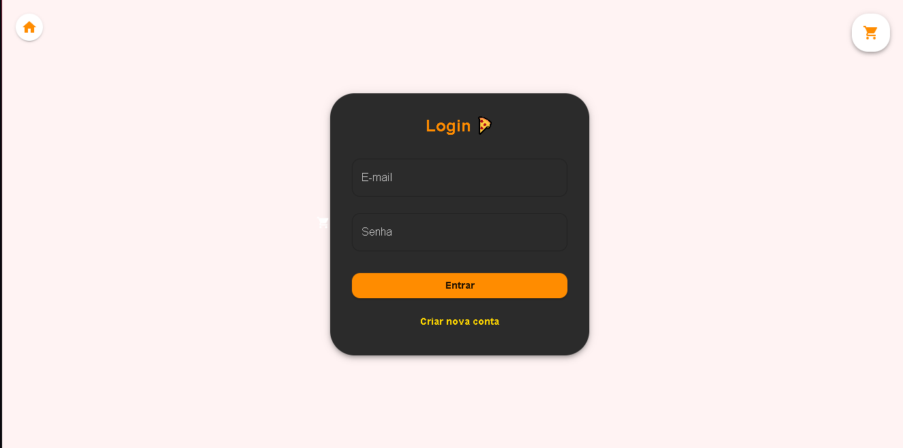
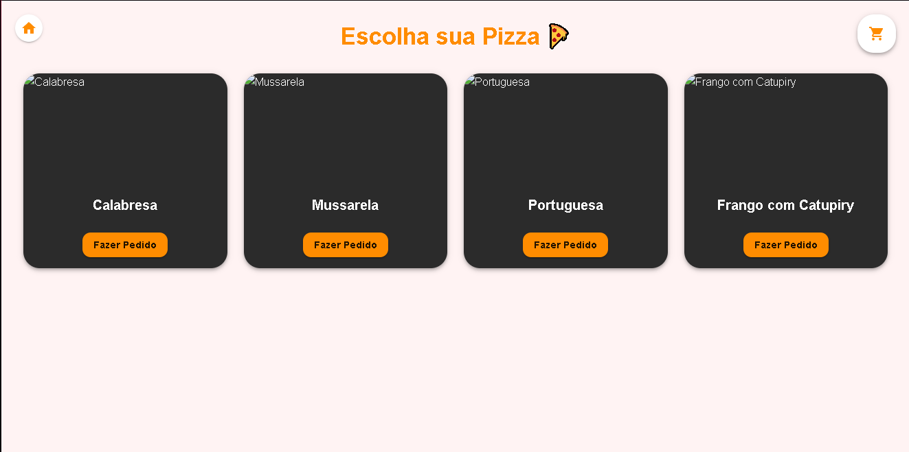
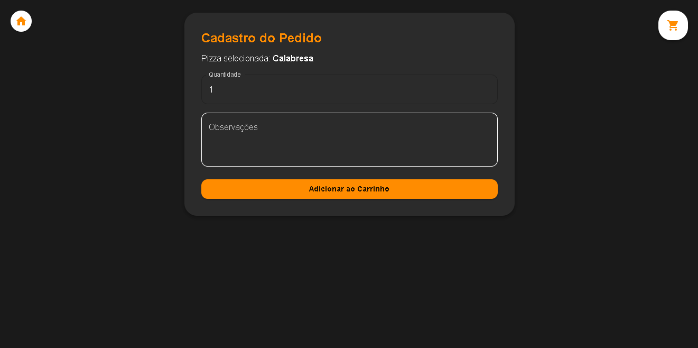

# 🍕 Pizzaria do Dev by bcl19


> Sistema completo de pizzaria com cadastro, login, carrinho e finalização de pedidos.

A **Pizzaria do Dev** é um projeto full-stack feito com **React + TypeScript** no front-end e **Node.js + Express + SQLite** no back-end.
Ideal para aprender conceitos de autenticação, CRUD, gerenciamento de estado e integração front-end/back-end.

---

## 🌐 Demo 
[🌟 Acesse o projeto no navegador](https://pizzaria-bernardo.vercel.app)

---

## 🛠 Tecnologias

**Front-end**

* React + TypeScript
* Material-UI (MUI)
* React Router DOM
* Axios

**Back-end**

* Node.js + Express
* SQLite
* bcryptjs para hash de senhas
* jsonwebtoken para autenticação

**Gerenciamento de estado**

* Context API (AuthContext e CartContext)

---

## 📦 Funcionalidades

### Usuário

* Cadastro com email, nome e senha.
* Login com autenticação JWT.
* Proteção de rotas e verificação de token.

### Pedidos

* Visualização de catálogo de pizzas.
* Adição de pizzas ao carrinho.
* Observações em cada pizza.
* Finalização de pedidos e envio ao back-end.

### Interface

* Responsiva e moderna usando **Material-UI**.
* Feedback visual para ações como cadastro, login e finalização.

---

## 🚀 Como rodar o projeto

### Pré-requisitos

* Node.js >= 18
* npm >= 9

### 1️⃣ Clonar o repositório

```bash
git clone https://github.com/bcl19/pizzaria-bernardo
cd pizzaria-do-dev
```

### 2️⃣ Instalar dependências

#### Back-end

```bash
cd pizzaria-backend
npm install
```

#### Front-end

```bash
cd pizzaria-frontend
npm install
```

### 3️⃣ Executar

#### Back-end

```bash
node server.js
```

Servidor rodando em `http://localhost:5000`

#### Front-end

```bash
npm run dev
```

Front-end rodando em `http://localhost:5173`

---

## 📁 Estrutura do projeto

```

├─ pizzaria-backend/
│  ├─ server.js          # Servidor Express
│  ├─ database.db        # Banco SQLite
│  └─ package.json
├─ pizzaria-frontend/
│  ├─ src/
│  │  ├─ pages/
│  │  │  ├─ Login.tsx
│  │  │  ├─ Cadastro.tsx
│  │  │  ├─ Principal.tsx
│  │  │  ├─ CadPedido.tsx
│  │  │  └─ FinalPedido.tsx
│  │  ├─ context/
│  │  │  └─ CartContext.tsx
│  │  ├─ components/
│  │  │  └─ AuthContext.tsx
│  │  ├─ api/
│  │  │  └─ index.ts
│  │  └─ App.tsx
│  └─ package.json
└─ README.md
```

---

## 🔗 Endpoints Principais (API)

### Usuários

| Rota               | Método | Body                                   | Retorno     |
| ------------------ | ------ | -------------------------------------- | ----------- |
| `/api/auth/signup` | POST   | `{ nome, email, password }`            | `{ token }` |
| `/api/auth/login`  | POST   | `{ email, password }`                  | `{ token }` |
| `/api/auth/verify` | GET    | Header `Authorization: Bearer <token>` | `{ email }` |

### Pedidos

| Rota           | Método | Body                                                | Retorno                                         |
| -------------- | ------ | --------------------------------------------------- | ----------------------------------------------- |
| `/api/pedidos` | POST   | `{ pedidos: [{ pizza, quantidade, observacoes }] }` | `{ message: "Pedidos recebidos com sucesso!" }` |
| `/api/pedidos` | GET    | `?usuario_email=<email>`                            | `[ { id, pizza, quantidade, observacoes } ]`    |

---

## 💡 Boas práticas e segurança

* Senhas armazenadas com **bcrypt**.
* Autenticação com **JWT** para proteger rotas.
* Validação de dados no back-end para evitar registros inválidos.
* Context API para gerenciar carrinho e usuário globalmente.

---

## 📌 Observações

* Banco **SQLite** local, ideal para aprendizado.
* Para produção, recomenda-se PostgreSQL, MySQL ou MongoDB.
* Layout responsivo e adaptável para mobile e desktop.
* Projeto criado como portfólio para demonstração de skills full-stack.

---

## Capturas de tela

### Login e Cadastro


### Catálogo de Pizzas


### Carrinho e Finalização



---